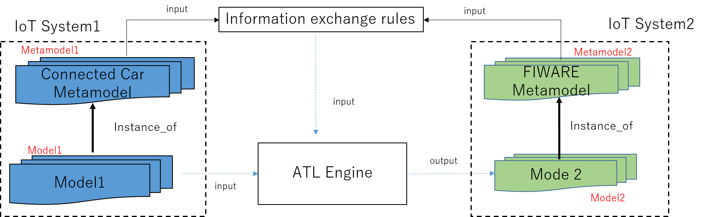
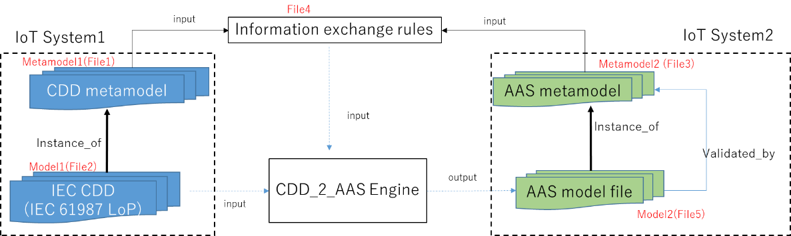

# Use cases of IoT interoperability  

## 1. Introduction 

In this project, two industrial use cases of ISO/IEC 21823-4: IoT Syntactic Interoperability are introduced.
The ISO/IEC 21823-4 specifies a methodology, requirements and a framework for IoT syntactic interoperability. 
The following two use cases are introduced; 

- use case 1: Data exchange between Connected car (ISO 22837 and ISO 14817) and FIWARE, and
- use case 2: Data conversion from IEC CDD (Common Data Dictionary) defined in accordance with IEC 61360 to AAS (Asset Administration shell) complying to AAS detailed specifications of Plattform Industrie 4.0.

## 2. ISO/IEC 21823-4: IoT syntactic interoperability overview 

The [ISO/IEC 21823-4](https://www.iec.ch/dyn/www/f?p=103:38:505161326783782::::FSP_ORG_ID,FSP_APEX_PAGE,FSP_PROJECT_ID:20486,23,103541) provides specifications to achieve the syntactic interoperability among IoT systems.
IoT systems are those with IoT devices such as sensors or actuators. 
As IoT systems can use information models expressed with different syntax such as format, structure or data constraints, there are requirements to support syntactic data exchange among IoT systems.

In ISO/IEC 21823-4, a metamodel-driven methodology is specified. 
With information exchange rules based on metamodels, data exchange between IoT systems can be achieved. 

## 3. Use case 1: Data exchange between Connected car and FIWARE 

This use case is implemented complying to ISO/IEC 21823-4 Annex B.
In this use case, information exchange rules between Metamodel1 (for probe data of connected cars) and Metamodel2 (FIWARE) are defined with ATL (Atlas Transformation Language). 
With the implemented rule interpreter, Model1 and its data in compliance with Metamodel1 can be transformed to corresponding Model2 and data of Metamodel2,
and vice versa. 

**Figure 1: Use case 1 relationships to ISO/IEC 21823-4** 

## 4. Use case 2: Data conversion from IEC CDD to AAS (Asset Administration Shell)

This use case is implemented for applying ISO/IEC 21823-4 to IIoT (industrial IoT).
In this use case, we implement a convertor CDD_2_AAS according to ISO/IEC 21823-4, which transforms IEC 61987 CDD of IoT system1 to AAS of IoT system2.
Relationships between this use case and ISO/IEC 21823-4 are shown in Figure 2. 

**Figure 2: Use case 2 relationships to ISO/IEC 21823-4** 

- Metamodel1 is the metamodel defined in [IEC 61360-1](https://webstore.iec.ch/publication/28560):Standard data element types with associated classification scheme - Part 1: Definitions - Principles and methods.
- Model1 is the IEC 61987 CDD model comlying to Metamodel1. [IEC 61987 CDD](https://cdd.iec.ch/cdd/iec61987/iec61987.nsf/TreeFrameset?OpenFrameSet&ongletactif=1) model contains entities defined in the IEC 61987 series: 
industrial-process measurement and control - Data structures and elements in process equipment catalogues. 
- Metamodel2 is the metamodel defined in AAS. AAS is a standard model defined for industrial IoT. Its detailed metamodel can be referred through  
[Plattform Industrie 4.0 - Details of the Asset Administration Shell - Part 1 (plattform-i40.de)](https://www.plattform-i40.de/IP/Redaktion/EN/Downloads/Publikation/Details_of_the_Asset_Administration_Shell_Part1_V3.html). 
- Information exchange rules between Metamodel1 and Metamodel2 are described with an extended syntax of "Relation" in IEC 61360-1.

Model2 in compliance with Metamodel2 are automatically generated with this CDD_2_AAS converter.
 

## 5. Acknowledgment 

These usecases were developed by a project supported by Ministry of Economy,Trade and Industry (METI),Japan. 

 
