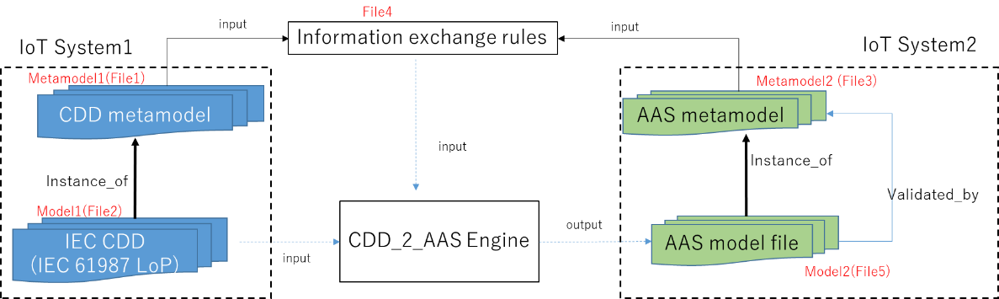

# IoT相互運用性のユースケース  

## 1. はじめに

このプロジェクトでは、ISO/IEC 21823-4:IoT Syntactic Interoperability (IoTシンタクティック相互運用性) の2つの産業応用ユースケースを紹介します。
ISO/IEC 21823-4は、IoT Syntactic Interoperabilityを実現するための方法論、要求、およびフレームワークを定義します。
下記2つのユースケースが紹介されています。

- ユースケース1：自動車のプローブデータ (ISO 22837およびISO 14817) からFIWAREへの変換
- ユースケース2：IEC 61360に従って定義されたIEC CDD (Common Data Dictionary) からPlattform Industrie 4.0の仕様に準拠するAAS (Asset Administration Shell) へのデータ変換

## 2. ISO/IEC 21823-4:IoT Syntactic Interoperabilityの概要

[ISO/IEC 21823-4](https://www.iec.ch/dyn/www/f?p=103:38:505161326783782::::FSP_ORG_ID,FSP_APEX_PAGE,FSP_PROJECT_ID:20486,23,103541)
は、IoTシステム間のデータ相互運用性をシンタクス視点から実現するための仕様を定めています。
IoTシステムは、IoTセンサーやアクチュエーターなどのIoTデバイスを備えたシステムです。
これらのシステムが利用するデータは、異なる構文（シンタクス：データのフォーマット、構造、制約など）で記述されるため、
IoTシステム間のデータ変換では、構文の違いを考慮する必要があります。
ISO/IEC 21823-4では、構文の違いをメタモデルに基づく情報交換ルールによって解消し、IoTシステム間のデータ変換を実現します。

## 3.ユースケース1：自動車のプローブデータからFIWAREへの変換

このユースケースは、ISO/IEC 21823-4 AnnexBに準拠して実装されています。
このユースケースでは、Metamodel1（自動車のプローブデータ）とMetamodel2（FIWARE）の間の情報交換ルールは、
ATL（Atlas Transformation Language）で定義されています。
Metamodel1に準拠するModel1とそのデータを、Metamodel2に準拠するModel2とデータに変換出来ます。
なお、同じ仕組みを用いて、IoT System2からIoT System1へのデータ逆変換ができます。

**図1:ISO/IEC21823-4とユースケース1の関係**

## 4.ユースケース2：IEC CDDからAAS(Asset Administration Shell:アセット管理シェル)へのデータ変換

このユースケースは、ISO/IEC 21823-4をIIoT(Industrial IoT:産業IoT)に適用した実装です。
このユースケースでは、ISO/IEC 21823-4に準拠した変換モジュール (CDD_2_AAS) を実装し、
IoT system1が利用するIEC 61987 CDDからIoT system2が利用するAASに変換します。
このユースケースとISO/IEC21823-4の関係は図2に示します。

**図2：ISO / IEC21823-4とユースケース2の関係**

- Metamodel1は、[IEC 61360-1](https://webstore.iec.ch/publication/28560):Standard data element types with associated classification scheme - Part 1: Definitions - Principles and methodsの仕様に準拠するメタモデルです。
- Model1は、Metamodel1に準拠するIEC 61987 CDDモデルです。プロセスオートメーション分野に利用されてます。
[IEC 61987 CDD](https://cdd.iec.ch/cdd/iec61987/iec61987.nsf/TreeFrameset?OpenFrameSet&ongletactif=1)モデルには、IEC 61987シリーズ:industrial-process measurement and control - Data structures and elements in process equipment cataloguesで定義されたエンティティが含まれています。
- Metamodel2は、AASが利用するメタモデルです。AASは、産業IoT用に定義された標準アセット管理シェルです。AASメタモデルの詳細は、[Plattform Industrie 4.0 - Details of the Asset Administration Shell - Part 1 (plattform-i40.de)](https://www.plattform-i40.de/IP/Redaktion/EN/Downloads/Publikation/Details_of_the_Asset_Administration_Shell_Part1_V3.html)で定義されています。
- Metamodel1とMetamodel2の間の情報交換ルールは、IEC61360-1の「Relation」の拡張構文で記述されています。

Metamodel2に準拠するModel2は、CDD_2_AASを使用して自動的に生成されます。
 

## 5.謝辞
本ユースケース開発は、経済産業省の助成を受けたものです。
