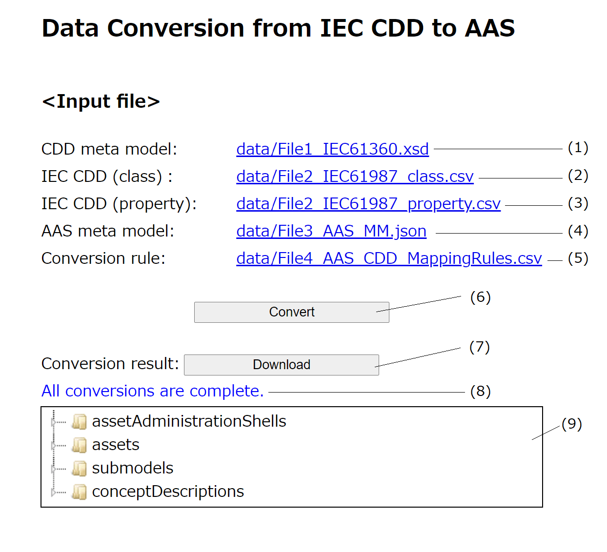

# Usecase2: Data conversion from IEC CDD to AAS  

# Description
This tool is a use case implementation of ISO/IEC 21823-4. 
In this use case, we implement a tool taht converts IoT System1 using IEC 61987 CDD to IoT System2 using AAS according to ISO/IEC 21823-4.
Via information exchange rules between Metamodel1 (IEC CDD) and Metamodel2 (AAS),
Model1 of IEC 61987 CDD can be automatically converted to Model2 complying to Metamodel2. 

# Installation
## Prerequisite
nodejs and npm need to be pre-installed. 
For Windows, you can download the installer from https://nodejs.org/.
The operation in the following environment has been confirmed.
- Windows 10
- nodejs 4.1.6
- npm 6.13.4

## Download
From  https://github.com/21823-4/usecases, click "Code" in the upper right corner of the screen and download the file from "Download ZIP".
If Git is installed, you can also download it by using clone with the following command.

```
git clone https://github.com/21823-4/usecases.git
```

## Installing dependent modules
Run the following command in the iso-iec-21823-4\usecase2 directory.

```
npm ci
```

If successful, you will see a message similar to the following:

```
added (xxx) packages in (yyy) s
```

## Build project
Run the following command in the iso-iec-21823-4\usecase2 directory.

```
npm run build
```

If successful, you will see a message similar to the following:
```
webpack 5.44.0 compiled successfully in (xxx) ms
```

Verify that the "dist" directory has been generated after the build, and the index.html is generated in the "dist" directory.


# Usage
## Running Demo
Run the following command in the iso-iec-21823-4\usecase2 directory.

```
npx serve ./dist
```
Then you will see a message similar to the following.

```
   ┌────────────────────────────────────────────────────┐
   │                                                    │
   │   Serving!                                         │
   │                                                    │
   │   - Local:            http://localhost:3000        │
   │   - On Your Network:  http://(PC IP Address):3000  │
   │                                                    │
   │   Copied local address to clipboard!               │
   │                                                    │
   └────────────────────────────────────────────────────┘
```

When you open the address (E.g.; http://localhost:3000) from the browser,
the following screen is displayed.




|     | Name                | Description                                                  |
| --- | ------------------- | ----------------------------------------------               |
| (1)  | CDD METAMODEL       | Metamodel1: IEC CDD metamodel                                |
| (2)  | IEC CDD(class)    | Class examples defined in Model1                             |
| (3)  | IEC CDD(property) | Property examples defined in Model1                        |
| (4)  | AAS METAMODEL       | Metamodel2: AAS metamodel                                    |
| (5)  | Conversion rules  | Information exchange rules                                   |
| (6)  | Conversion button | Execute converting                                           |
| (7)  | Download button     | Download result file (JSON).                                 |
| (8)  | message display area          | a message is displayed.                            |
| (9)  | conversion result display area| display data conversion results in a tree format.  |


### How to use this tool

1. With the conversion button(6), the conversion is performed based on the information from the input file
- if the conversion is successful, the results are displayed in the conversion result display area(9), and the download button (7) is enabled.
- if the conversion fails, the error messages are displayed in the message display area (9). In this case, the download button (7) is not enabled.

2. If the conversion is successfule, you can download the result JSON file with the download button (7). 

## How to convert your own files
### config.json (dist/config.json)
In the configuration file:"config.json", you can setup the path of input files for conversion. 
After building the project, this "config.json" is generated under the directory of "dist", and you can modify it to change the input files.
This JSON file has the following keys.
Each file path is specified by a relative path from this config.json.

| key name      | content                                | summary                               |
| ------------- | ---------------------------------------|----------------------------           |
| File1         | IEC CDD metamodel file path            | A simplified IEC CDD metamodel.       |
| File2class    | IEC CDD(class) file path               | A csv file that contains IEC CDD example class.         | 
| File2property | IEC CDD(property) file path           | A csv file that contains IEC CDD example property.      |
| File3         | AAS metamodel file path                 | A JSON-schema file that defines the schema of the data transformation results.|  
| File4         | Information exchange rules file path   | A csv file that contains information exchange rules.          | 
| Template      | template file path                     | A file contains required entities not avalibale from IEC CDD. |


### Config.json example

```
{
    "File1": "data/File1_IEC61360.xsd",
    "File2class": "data/File2_IEC61987_class.csv",
    "File2property": "data/File2_IEC61987_property.csv",
    "File3": "data/File3_AAS_MM.json",
    "File4": "data/File4_AAS_CDD_MappingRules.csv",
    "Template": "data/File5_template.json"
}
```

# Source Tree

```
usecase2
├─img
│   image.png
│   image2.png
│
├─src
│  ├─convert_engine
│  │      cddconvert.ts       // top function of convert engine.
│  │      AASMetamodel.ts     // AAS Metamodel Class.
│  │      ConvertRules.ts     // Information exchange rules Class.
│  │      IecCddClass.ts      // IecCddClass/IecCddProp Class.
│  │      ResultRetention.ts  // ResultRetention Class.
│  │      const.ts            // Definition of constant strings, etc.
│  │      messages.ts         // related to console message.
│  │      util.ts             // utility functions.
│  │
│  └─web_form
│         config.json         // input file configuration JSON.
│         index.html          // web UI.
│         index.ts            // script for web UI.
│         styles.css          // stylesheet for web UI.
│
├─input_data                // input data for Web UI.
└─output_data               // output data of default input data.

```
